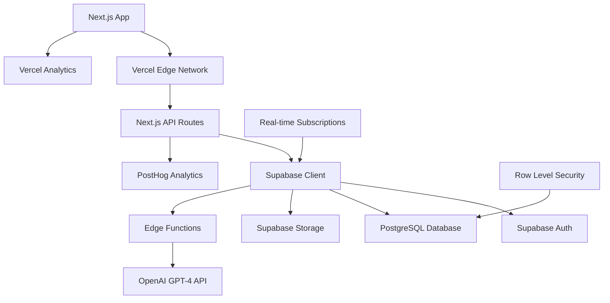

# 🧠 EmotionWise - 감정 분석 및 관리 웹 서비스

> 당신의 감정을 이해하고, 건강하게 관리하는 AI 기반 감정 코칭 플랫폼

## 📋 목차

- [프로젝트 소개](#-프로젝트-소개)
- [주요 기능](#-주요-기능)
- [기술 스택](#-기술-스택)
- [시스템 아키텍처](#-시스템-아키텍처)
- [설치 및 실행](#-설치-및-실행)
- [API 문서](#-api-문서)
- [개발 가이드](#-개발-가이드)
- [배포](#-배포)
- [기여하기](#-기여하기)
- [라이선스](#-라이선스)

## 🎯 프로젝트 소개

EmotionWise는 사용자가 자신의 감정을 명확히 인식하고 효과적으로 관리할 수 있도록 돕는 AI 기반 감정 분석 서비스입니다.

### 핵심 가치
- **감정 인식**: 복잡한 감정 상태를 명확히 파악
- **원인 분석**: AI를 통한 감정 발생 원인 분석
- **맞춤형 조언**: 개인별 상황에 최적화된 감정 관리 방법 제공
- **패턴 학습**: 개인의 감정 패턴을 학습하여 예방적 관리 지원

### 타겟 사용자
- 감정 관리에 어려움을 겪는 20-40대 직장인
- 대인관계 및 업무 스트레스로 인한 감정 기복이 심한 사용자
- 자기계발 및 정신건강 관리에 관심이 높은 사용자

## ✨ 주요 기능

### 🎪 감정 상황 입력 시스템
- **구조화된 상황 기록**: 시간, 장소, 동반자, 상황 유형 체계적 입력
- **대화 내용 분석**: 자유 텍스트 및 음성 입력 지원
- **감정 상태 측정**: 8가지 기본 감정 + 강도 측정 + 복합 감정 지원

### 🤖 AI 감정 분석 엔진
- **실시간 감정 분석**: 3초 이내 분석 결과 제공
- **원인 파악**: 대화 내용과 상황 맥락 기반 감정 트리거 식별
- **개인화 학습**: 개인별 감정 패턴 학습 및 예측

### 💡 맞춤형 조언 시스템
- **즉시 실행 조언**: 호흡법, 명상, 운동 등 즉시 적용 가능한 방법
- **장기 관리 전략**: 개인 패턴 기반 예방적 감정 관리 전략
- **단계별 가이드**: 실행 체크리스트 및 효과 추적

### 📊 감정 히스토리 대시보드
- **트렌드 시각화**: 일/주/월별 감정 변화 차트
- **패턴 분석**: 감정 트리거 분석 및 통계
- **개선 추적**: 감정 관리 효과 측정 및 진행률 확인

## 🛠 기술 스택

### Frontend & Framework
```
Next.js 14 (App Router)
React 18
TypeScript 5.0
Tailwind CSS 3.4
Framer Motion (애니메이션)
Radix UI (컴포넌트)
React Hook Form + Zod (폼 관리)
Zustand (클라이언트 상태 관리)
```

### Backend & Database
```
Supabase (BaaS)
├── PostgreSQL (데이터베이스)
├── Auth (인증 시스템)
├── Edge Functions (서버리스)
├── Realtime (실시간 구독)
├── Storage (파일 저장)
└── Row Level Security (보안)
```

### AI & Analytics
```
OpenAI GPT-4 API
Supabase Edge Functions (AI 로직)
Vercel Analytics
PostHog (사용자 분석)
Sentry (에러 추적)
```

### DevOps & Deployment
```
Vercel (호스팅 & CI/CD)
GitHub Actions (추가 워크플로우)
Supabase CLI (데이터베이스 관리)
ESLint + Prettier (코드 품질)
```

### UI/UX Libraries
```
Chart.js / Recharts (데이터 시각화)
React Hot Toast (알림)
Lucide React (아이콘)
next-themes (다크모드)
```

## 🏗 시스템 아키텍처



## 🚀 설치 및 실행

### 사전 요구사항
- Node.js 18.17 이상
- npm, yarn, 또는 pnpm
- Git
- Supabase 계정

### 1. 프로젝트 설정
```bash
# 저장소 클론
git clone https://github.com/your-org/emotion-wise.git
cd emotion-wise

# 의존성 설치
npm install
# 또는
yarn install
# 또는
pnpm install
```

### 2. Supabase 프로젝트 설정
```bash
# Supabase CLI 설치 (전역)
npm install -g supabase

# Supabase 로그인
supabase login

# 로컬 개발 환경 시작
supabase start

# 데이터베이스 스키마 적용
supabase db reset
```

### 3. 환경 변수 설정
```bash
# .env.local 파일 생성
cp .env.example .env.local
```

`.env.local` 파일 설정:
```env
# Supabase 설정
NEXT_PUBLIC_SUPABASE_URL=your_supabase_project_url
NEXT_PUBLIC_SUPABASE_ANON_KEY=your_supabase_anon_key
SUPABASE_SERVICE_ROLE_KEY=your_service_role_key

# OpenAI API
OPENAI_API_KEY=your_openai_api_key

# 분석 도구
NEXT_PUBLIC_POSTHOG_KEY=your_posthog_key
NEXT_PUBLIC_POSTHOG_HOST=https://app.posthog.com

# Sentry (프로덕션)
SENTRY_DSN=your_sentry_dsn
```

### 4. 개발 서버 실행
```bash
# 개발 서버 시작
npm run dev
# 또는
yarn dev
# 또는
pnpm dev

# 브라우저에서 http://localhost:3000 접속
```

### 5. 데이터베이스 시드 데이터
```bash
# 시드 데이터 삽입
npm run db:seed

# 또는 Supabase Studio에서 직접 관리
# http://localhost:54323
```

## 📚 API 문서

### Supabase 클라이언트 사용

#### 인증
```typescript
// app/lib/supabase.ts
import { createClientComponentClient } from '@supabase/auth-helpers-nextjs'

const supabase = createClientComponentClient()

// 회원가입
const signUp = async (email: string, password: string, userData: any) => {
  const { data, error } = await supabase.auth.signUp({
    email,
    password,
    options: {
      data: {
        name: userData.name,
        age: userData.age,
        occupation: userData.occupation,
      }
    }
  })
  return { data, error }
}

// 로그인
const signIn = async (email: string, password: string) => {
  const { data, error } = await supabase.auth.signInWithPassword({
    email,
    password,
  })
  return { data, error }
}
```

#### 감정 기록 CRUD
```typescript
// 감정 기록 생성
const createEmotionRecord = async (emotionData: EmotionRecord) => {
  const { data, error } = await supabase
    .from('emotion_records')
    .insert({
      user_id: (await supabase.auth.getUser()).data.user?.id,
      situation: emotionData.situation,
      conversation_content: emotionData.conversation,
      emotions: emotionData.emotions,
      created_at: new Date().toISOString(),
    })
    .select()
    .single()
  
  return { data, error }
}

// 감정 기록 조회
const getEmotionRecords = async (userId: string, limit = 20) => {
  const { data, error } = await supabase
    .from('emotion_records')
    .select(`
      *,
      emotion_analysis (
        primary_emotion,
        triggers,
        confidence_score,
        advice_recommendations
      )
    `)
    .eq('user_id', userId)
    .order('created_at', { ascending: false })
    .limit(limit)
  
  return { data, error }
}
```

### API Routes (Next.js)

#### AI 감정 분석
```typescript
// app/api/analyze-emotion/route.ts
import { NextRequest, NextResponse } from 'next/server'
import { createRouteHandlerClient } from '@supabase/auth-helpers-nextjs'
import { analyzeEmotionWithAI } from '@/lib/ai-service'

export async function POST(request: NextRequest) {
  const supabase = createRouteHandlerClient({ cookies })
  
  // 인증 확인
  const { data: { user }, error: authError } = await supabase.auth.getUser()
  if (authError || !user) {
    return NextResponse.json({ error: 'Unauthorized' }, { status: 401 })
  }

  const { emotionRecordId, conversationContent, situationContext } = await request.json()

  try {
    // AI 분석 실행
    const analysisResult = await analyzeEmotionWithAI({
      conversation: conversationContent,
      situation: situationContext,
      userId: user.id
    })

    // 분석 결과 저장
    const { data, error } = await supabase
      .from('emotion_analysis')
      .insert({
        emotion_record_id: emotionRecordId,
        primary_emotion: analysisResult.primaryEmotion,
        triggers: analysisResult.triggers,
        confidence_score: analysisResult.confidence,
        advice_recommendations: analysisResult.advice,
        analysis_metadata: analysisResult.metadata
      })
      .select()
      .single()

    return NextResponse.json({ success: true, analysis: data })
  } catch (error) {
    console.error('AI 분석 오류:', error)
    return NextResponse.json(
      { error: 'Analysis failed' }, 
      { status: 500 }
    )
  }
}
```

### Supabase Edge Functions

#### 고급 AI 분석 함수
```typescript
// supabase/functions/advanced-emotion-analysis/index.ts
import { serve } from "https://deno.land/std@0.168.0/http/server.ts"
import { createClient } from 'https://esm.sh/@supabase/supabase-js@2'

const corsHeaders = {
  'Access-Control-Allow-Origin': '*',
  'Access-Control-Allow-Headers': 'authorization, x-client-info, apikey, content-type',
}

serve(async (req) => {
  if (req.method === 'OPTIONS') {
    return new Response('ok', { headers: corsHeaders })
  }

  try {
    const supabase = createClient(
      Deno.env.get('SUPABASE_URL') ?? '',
      Deno.env.get('SUPABASE_SERVICE_ROLE_KEY') ?? ''
    )

    const { conversation, userHistory, situationContext } = await req.json()

    // OpenAI API 호출
    const openAIResponse = await fetch('https://api.openai.com/v1/chat/completions', {
      method: 'POST',
      headers: {
        'Authorization': `Bearer ${Deno.env.get('OPENAI_API_KEY')}`,
        'Content-Type': 'application/json',
      },
      body: JSON.stringify({
        model: 'gpt-4',
        messages: [
          {
            role: 'system',
            content: `당신은 감정 분석 전문가입니다. 사용자의 대화 내용과 상황을 분석하여 감정 상태와 원인을 파악하고, 맞춤형 조언을 제공하세요.`
          },
          {
            role: 'user',
            content: `상황: ${JSON.stringify(situationContext)}\n대화 내용: ${conversation}\n이전 패턴: ${JSON.stringify(userHistory)}`
          }
        ],
        max_tokens: 1000,
        temperature: 0.3,
      }),
    })

    const aiResult = await openAIResponse.json()
    const analysis = JSON.parse(aiResult.choices[0].message.content)

    return new Response(
      JSON.stringify({ success: true, analysis }),
      { 
        headers: { ...corsHeaders, 'Content-Type': 'application/json' },
        status: 200 
      }
    )
  } catch (error) {
    return new Response(
      JSON.stringify({ error: error.message }),
      { 
        headers: { ...corsHeaders, 'Content-Type': 'application/json' },
        status: 500 
      }
    )
  }
})
```

## 🔧 개발 가이드

### 프로젝트 구조
```
emotion-wise/
├── app/                          # Next.js 14 App Router
│   ├── (auth)/                  # 인증 관련 페이지
│   │   ├── login/
│   │   └── signup/
│   ├── (dashboard)/             # 대시보드 페이지
│   │   ├── emotions/
│   │   ├── analysis/
│   │   └── settings/
│   ├── api/                     # API Routes
│   │   ├── analyze-emotion/
│   │   ├── dashboard/
│   │   └── webhooks/
│   ├── components/              # React 컴포넌트
│   │   ├── ui/                 # Radix UI 기반 컴포넌트
│   │   ├── forms/              # 폼 컴포넌트
│   │   ├── charts/             # 차트 컴포넌트
│   │   └── layout/             # 레이아웃 컴포넌트
│   ├── lib/                     # 유틸리티 및 설정
│   │   ├── supabase.ts         # Supabase 클라이언트
│   │   ├── ai-service.ts       # AI 서비스 로직
│   │   ├── utils.ts            # 공통 유틸리티
│   │   └── validations.ts      # Zod 스키마
│   ├── hooks/                   # 커스텀 훅
│   │   ├── use-emotion-records.ts
│   │   ├── use-auth.ts
│   │   └── use-analytics.ts
│   ├── store/                   # Zustand 스토어
│   │   ├── auth-store.ts
│   │   ├── emotion-store.ts
│   │   └── ui-store.ts
│   ├── types/                   # TypeScript 타입 정의
│   │   ├── database.ts
│   │   ├── emotion.ts
│   │   └── api.ts
│   ├── globals.css             # 전역 스타일
│   ├── layout.tsx              # 루트 레이아웃
│   └── page.tsx                # 홈페이지
├── supabase/
│   ├── functions/              # Edge Functions
│   ├── migrations/             # 데이터베이스 마이그레이션
│   ├── seed.sql               # 시드 데이터
│   └── config.toml            # Supabase 설정
├── public/                     # 정적 파일
├── docs/                       # 문서
├── .env.example               # 환경 변수 예시
├── next.config.js             # Next.js 설정
├── tailwind.config.js         # Tailwind 설정
├── tsconfig.json              # TypeScript 설정
└── package.json
```

### 데이터베이스 스키마
```sql
-- supabase/migrations/001_initial_schema.sql

-- 사용자 프로필 확장
CREATE TABLE public.user_profiles (
  id UUID REFERENCES auth.users ON DELETE CASCADE,
  name TEXT NOT NULL,
  age INTEGER,
  occupation TEXT,
  timezone TEXT DEFAULT 'Asia/Seoul',
  notification_preferences JSONB DEFAULT '{}',
  created_at TIMESTAMP WITH TIME ZONE DEFAULT NOW(),
  updated_at TIMESTAMP WITH TIME ZONE DEFAULT NOW(),
  PRIMARY KEY (id)
);

-- 감정 기록 테이블
CREATE TABLE public.emotion_records (
  id UUID DEFAULT gen_random_uuid() PRIMARY KEY,
  user_id UUID REFERENCES auth.users(id) ON DELETE CASCADE,
  situation JSONB NOT NULL, -- {datetime, location, people, type}
  conversation_content TEXT NOT NULL,
  emotions JSONB NOT NULL, -- [{type, intensity}]
  audio_file_url TEXT,
  created_at TIMESTAMP WITH TIME ZONE DEFAULT NOW(),
  updated_at TIMESTAMP WITH TIME ZONE DEFAULT NOW()
);

-- AI 분석 결과 테이블
CREATE TABLE public.emotion_analysis (
  id UUID DEFAULT gen_random_uuid() PRIMARY KEY,
  emotion_record_id UUID REFERENCES emotion_records(id) ON DELETE CASCADE,
  primary_emotion TEXT NOT NULL,
  triggers TEXT[] NOT NULL,
  confidence_score DECIMAL(3,2) NOT NULL,
  advice_recommendations JSONB NOT NULL,
  analysis_metadata JSONB DEFAULT '{}',
  created_at TIMESTAMP WITH TIME ZONE DEFAULT NOW()
);

-- 조언 피드백 테이블
CREATE TABLE public.advice_feedback (
  id UUID DEFAULT gen_random_uuid() PRIMARY KEY,
  emotion_analysis_id UUID REFERENCES emotion_analysis(id) ON DELETE CASCADE,
  advice_id TEXT NOT NULL,
  effectiveness_rating INTEGER CHECK (effectiveness_rating >= 1 AND effectiveness_rating <= 10),
  execution_status TEXT CHECK (execution_status IN ('completed', 'partial', 'not_executed')),
  user_notes TEXT,
  created_at TIMESTAMP WITH TIME ZONE DEFAULT NOW()
);

-- RLS 정책 설정
ALTER TABLE public.user_profiles ENABLE ROW LEVEL SECURITY;
ALTER TABLE public.emotion_records ENABLE ROW LEVEL SECURITY;
ALTER TABLE public.emotion_analysis ENABLE ROW LEVEL SECURITY;
ALTER TABLE public.advice_feedback ENABLE ROW LEVEL SECURITY;

-- 사용자는 자신의 데이터만 접근 가능
CREATE POLICY "Users can view own profile" ON user_profiles FOR SELECT USING (auth.uid() = id);
CREATE POLICY "Users can update own profile" ON user_profiles FOR UPDATE USING (auth.uid() = id);
CREATE POLICY "Users can view own emotion records" ON emotion_records FOR SELECT USING (auth.uid() = user_id);
CREATE POLICY "Users can insert own emotion records" ON emotion_records FOR INSERT WITH CHECK (auth.uid() = user_id);
-- 분석 및 피드백 정책도 동일하게 적용
```

### 타입 정의
```typescript
// app/types/database.ts
export interface Database {
  public: {
    Tables: {
      user_profiles: {
        Row: {
          id: string
          name: string
          age: number | null
          occupation: string | null
          timezone: string
          notification_preferences: any
          created_at: string
          updated_at: string
        }
        Insert: {
          id: string
          name: string
          age?: number | null
          occupation?: string | null
          timezone?: string
          notification_preferences?: any
        }
        Update: {
          name?: string
          age?: number | null
          occupation?: string | null
          timezone?: string
          notification_preferences?: any
          updated_at?: string
        }
      }
      emotion_records: {
        Row: {
          id: string
          user_id: string
          situation: any
          conversation_content: string
          emotions: any
          audio_file_url: string | null
          created_at: string
          updated_at: string
        }
        Insert: {
          user_id: string
          situation: any
          conversation_content: string
          emotions: any
          audio_file_url?: string | null
        }
        Update: {
          situation?: any
          conversation_content?: string
          emotions?: any
          audio_file_url?: string | null
          updated_at?: string
        }
      }
      // ... 다른 테이블들
    }
  }
}
```

### 커스텀 훅 예시
```typescript
// app/hooks/use-emotion-records.ts
import { useState, useEffect } from 'react'
import { createClientComponentClient } from '@supabase/auth-helpers-nextjs'
import { Database } from '@/types/database'

type EmotionRecord = Database['public']['Tables']['emotion_records']['Row']

export function useEmotionRecords() {
  const [records, setRecords] = useState<EmotionRecord[]>([])
  const [loading, setLoading] = useState(true)
  const [error, setError] = useState<string | null>(null)
  
  const supabase = createClientComponentClient<Database>()

  const fetchRecords = async () => {
    try {
      setLoading(true)
      const { data, error } = await supabase
        .from('emotion_records')
        .select(`
          *,
          emotion_analysis (
            primary_emotion,
            triggers,
            confidence_score,
            advice_recommendations
          )
        `)
        .order('created_at', { ascending: false })

      if (error) throw error
      setRecords(data || [])
    } catch (err) {
      setError(err instanceof Error ? err.message : 'Unknown error')
    } finally {
      setLoading(false)
    }
  }

  const createRecord = async (recordData: any) => {
    try {
      const { data, error } = await supabase
        .from('emotion_records')
        .insert(recordData)
        .select()
        .single()

      if (error) throw error
      
      // 실시간으로 목록 업데이트
      setRecords(prev => [data, ...prev])
      return { data, error: null }
    } catch (err) {
      return { data: null, error: err instanceof Error ? err.message : 'Unknown error' }
    }
  }

  useEffect(() => {
    fetchRecords()

    // 실시간 구독 설정
    const subscription = supabase
      .channel('emotion_records')
      .on('postgres_changes', {
        event: '*',
        schema: 'public',
        table: 'emotion_records'
      }, fetchRecords)
      .subscribe()

    return () => {
      subscription.unsubscribe()
    }
  }, [])

  return {
    records,
    loading,
    error,
    createRecord,
    refetch: fetchRecords
  }
}
```

### 테스트 설정
```typescript
// __tests__/setup.ts
import { beforeAll, afterAll, beforeEach } from 'vitest'
import { createClient } from '@supabase/supabase-js'

const supabase = createClient(
  process.env.SUPABASE_URL!,
  process.env.SUPABASE_SERVICE_ROLE_KEY!
)

beforeAll(async () => {
  // 테스트 데이터베이스 초기화
})

afterAll(async () => {
  // 테스트 데이터 정리
})

beforeEach(async () => {
  // 각 테스트 전 데이터 리셋
})
```

## 🚢 배포

### Vercel 배포 설정
```javascript
// next.config.js
/** @type {import('next').NextConfig} */
const nextConfig = {
  experimental: {
    serverActions: true,
  },
  images: {
    domains: ['your-supabase-project.supabase.co'],
  },
  async headers() {
    return [
      {
        source: '/api/:path*',
        headers: [
          { key: 'Access-Control-Allow-Origin', value: '*' },
          { key: 'Access-Control-Allow-Methods', value: 'GET,OPTIONS,PATCH,DELETE,POST,PUT' },
          { key: 'Access-Control-Allow-Headers', value: 'X-CSRF-Token, X-Requested-With, Accept, Accept-Version, Content-Length, Content-MD5, Content-Type, Date, X-Api-Version' },
        ],
      },
    ]
  },
}

module.exports = nextConfig
```

### 환경별 배포
```bash
# 개발 환경 배포
vercel --prod --env NEXT_PUBLIC_SUPABASE_URL=dev_url

# 프로덕션 배포
git push origin main  # Vercel이 자동 배포

# Supabase 마이그레이션 적용
supabase db push --linked
```

### GitHub Actions 워크플로우
```yaml
# .github/workflows/ci.yml
name: CI/CD Pipeline

on:
  push:
    branches: [main, develop]
  pull_request:
    branches: [main]

jobs:
  test:
    runs-on: ubuntu-latest
    steps:
      - uses: actions/checkout@v4
      - uses: actions/setup-node@v4
        with:
          node-version: '18'
          cache: 'npm'
      
      - run: npm ci
      - run: npm run lint
      - run: npm run type-check
      - run: npm run test
      
      - name: Run E2E tests
        run: npm run test:e2e
        env:
          SUPABASE_URL: ${{ secrets.SUPABASE_URL }}
          SUPABASE_ANON_KEY: ${{ secrets.SUPABASE_ANON_KEY }}

  deploy:
    needs: test
    runs-on: ubuntu-latest
    if: github.ref == 'refs/heads/main'
    steps:
      - uses: actions/checkout@v4
      - uses: amondnet/vercel-action@v25
        with:
          vercel-token: ${{ secrets.VERCEL_TOKEN }}
          vercel-args: '--prod'
          vercel-org-id: ${{ secrets.ORG_ID }}
          vercel-project-id: ${{ secrets.PROJECT_ID }}
```

## 🤝 기여하기

### 기여 방법
1. 이슈 확인 또는 새 이슈 생성
2. Fork 후 기능 브랜치 생성
3. 코드 작성 및 테스트
4. Pull Request 생성
5. 코드 리뷰 및 머지

### 개발 명령어
```bash
# 개발 서버 실행
npm run dev

# 린팅 및 포맷팅
npm run lint
npm run format

# 타입 체크
npm run type-check

# 테스트 실행
npm run test
npm run test:watch
npm run test:e2e

# 빌드
npm run build

# Supabase 관련
npm run db:reset      # 로컬 DB 리셋
npm run db:seed       # 시드 데이터 삽입
npm run db:generate   # 타입 생성
npm run db:push       # 스키마 푸시
```

### 코딩 컨벤션
```typescript
// 컴포넌트 예시
import { useState } from 'react'
import { createClientComponentClient } from '@supabase/auth-helpers-nextjs'

interface EmotionInputProps {
  onSubmit: (emotion: EmotionData) => void
  initialData?: EmotionData
}

export function EmotionInput({ onSubmit, initialData }: EmotionInputProps) {
  const [emotion, setEmotion] = useState<EmotionData>(initialData || {})
  const supabase = createClientComponentClient()

  const handleSubmit = async (data: EmotionData) => {
    // 비즈니스 로직
    onSubmit(data)
  }

  return (
    <form onSubmit={handleSubmit}>
      {/* 컴포넌트 내용 */}
    </form>
  )
}
```

## 📊 성능 지표

### 목표 KPI
- **Core Web Vitals**: LCP < 2.5s, FID < 100ms, CLS < 0.1
- **API 응답**: Next.js API Routes < 200ms
- **AI 분석**: Edge Functions < 3초
- **가용성**: Vercel 99.99% 업타임

### 